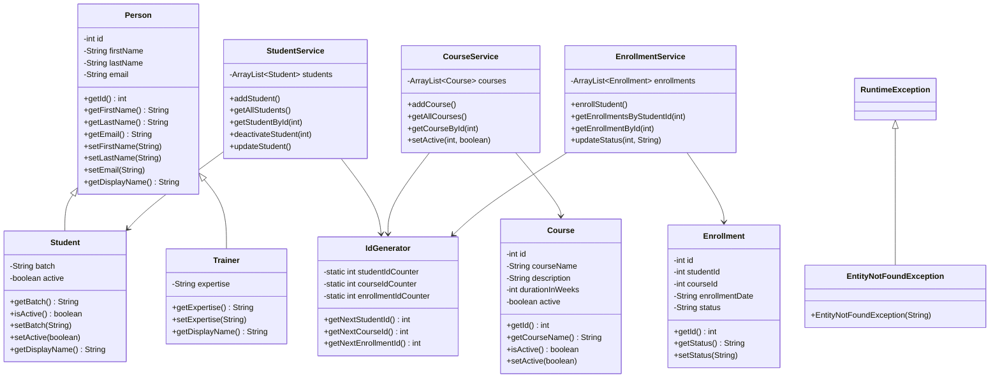

# LearnTrack

LearnTrack is a console based java project where you can manage students, courses and enrollments. You can add students, enroll them in courses and track their status. Everything runs in the terminal.

---

## How to run

Make sure you have JDK installed. Then from the project root:

```bash
find src -name "*.java" | xargs javac -d out
java -cp out com.airtribe.learntrack.Main
```

Or just open it in VS Code and hit the run button on Main.java.

---

## What you can do

- Add students, view them, search by ID, deactivate them
- Add courses, view them, toggle active/inactive
- Enroll a student into a course, view their enrollments, mark as completed or cancelled

---

## Project structure

```
src/com/airtribe/learntrack/
├── Main.java
├── entity/
│   ├── Person.java
│   ├── Student.java
│   ├── Trainer.java
│   ├── Course.java
│   └── Enrollment.java
├── service/
│   ├── StudentService.java
│   ├── CourseService.java
│   └── EnrollmentService.java
├── exception/
│   └── EntityNotFoundException.java
└── util/
    └── IdGenerator.java
```

---

## Class Diagram



---

## Docs

- [Setup Instructions](docs/Setup_Instructions.md)
- [JVM Basics](docs/JVM_Basics.md)
- [Design Notes](docs/Design_Notes.md)
