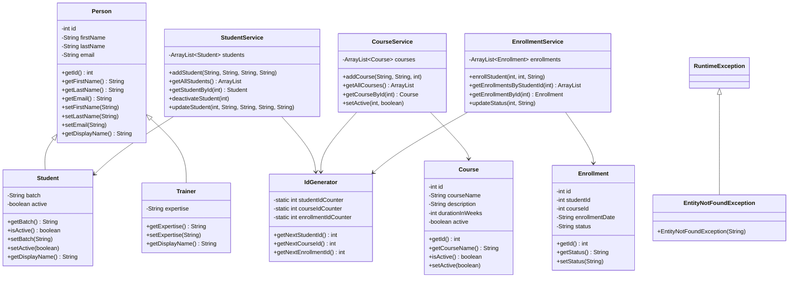

# LearnTrack

A console-based Student & Course Management System built using Core Java. It allows admins to manage students, courses, and enrollments through a menu-driven interface.

---

## How to Compile and Run

**Requirements:** JDK 21+

```bash
# From the project root, compile all files
find src -name "*.java" | xargs javac -d out

# Run the application
java -cp out com.airtribe.learntrack.Main
```

---

## Features

**Student Management**
- Add a new student (with or without email)
- View all students
- Search student by ID
- Deactivate a student

**Course Management**
- Add a new course
- View all courses
- Activate / Deactivate a course

**Enrollment Management**
- Enroll a student in a course
- View enrollments for a student
- Update enrollment status (ACTIVE / COMPLETED / CANCELLED)

---

## Package Structure

```
src/com/airtribe/learntrack/
├── Main.java                  # Entry point, menu-driven UI
├── entity/
│   ├── Person.java            # Base class
│   ├── Student.java           # Extends Person
│   ├── Trainer.java           # Extends Person
│   ├── Course.java
│   └── Enrollment.java
├── service/
│   ├── StudentService.java
│   ├── CourseService.java
│   └── EnrollmentService.java
├── exception/
│   └── EntityNotFoundException.java
└── util/
    └── IdGenerator.java
```

---

## Class Diagram



---

## Documentation

- [Setup Instructions](docs/Setup_Instructions.md)
- [JVM Basics](docs/JVM_Basics.md)
- [Design Notes](docs/Design_Notes.md)
